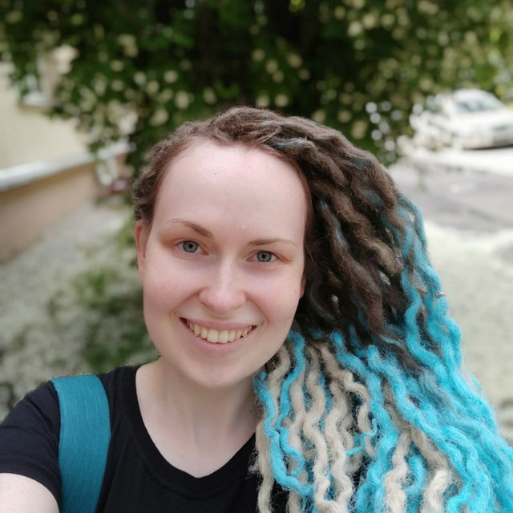

# Hanna Loshkareva


---

### Junior Frontend Developer

---

## Contact information:

**Phone:** +37063889388

**E-mail:** ann.loshkareva@gmail.com

**Telegram:** @Hanna_LF

**GitHub:** [HannaLoshkareva](https://github.com/HannaLoshkareva)

---

## About me:

Back in 2011, I received a librarian education, but I did not intend to be a librarian. I started studying web development back in 2017, but I didn’t have enough skills (first of all, knowledge of English) to enter the profession. Since then, I have been moving, albeit not very quickly, towards my goal of becoming a Frontend developer.

I like to work in a team, I find solutions for unsolvable (at first glance) tasks, I'm not afraid of difficulties, but I like to whine.

I believe that a person can learn everything if he really wants it.

---

## Skills:

* HTML5, CSS3 (BEM methodology)
* JavaScript (Basic)
* Git/GitHub
* Photoshop
* Windows OS, Linux (Ubuntu)
* Editors: SublimeText, Atom, VSCode

---

## Code example:

```
var slides = document.querySelectorAll('#slides .slide');
var currentSlide = 0;
var controls = document.querySelectorAll('.controls');
for(var i=0; i<controls.length; i++){
    controls[i].style.display = 'inline-block';
}

function nextSlide() {
 goToSlide(currentSlide+1);
}

function previousSlide() {
 goToSlide(currentSlide-1);
}

function goToSlide(n) {
 slides[currentSlide].className = 'slide';
 currentSlide = (n+slides.length)%slides.length;
 slides[currentSlide].className = 'slide showing';
}

var next = document.getElementById('next');
var previous = document.getElementById('previous');

next.onclick = function() {
 nextSlide();
};
previous.onclick = function() {
 previousSlide();
};
```

---

## Education:

* **Belarusian state university of culture**
    * Librarianship and bibliography. Management
* **IT Academy (2018)**
    * HTML, CSS и JavaScript ([Final project](https://github.com/HannaLoshkareva/AI_project.git))
* **IT Academy(2016)**
    * Software Testing Engineer

---

## Languages:

* **Belarusian** - native speaker
* **Russian** - native speaker
* **English** - A2 (B1 in process...)
* **Lithuanian** - A1